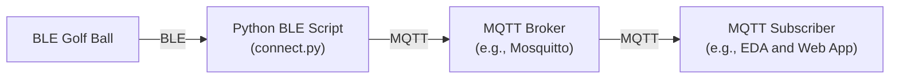

# putting-demo-summit
Demo material for Red Hat Summit demonstration with BLE golf ball

`connect.py` is designed to connect to a BLE-enabled golf ball, write a command to activate data collection, and listen to notifications from various characteristics that provide information about the golf ball's movements and interactions

`scan.py` is a helper app that allows somebody to search for a BLE device by regex match and print out the characteristics of that device

Event-Driven Ansible (EDA) is able to subscribe to messaging layer components like MQTT which allows EDA to pick up all events published to any topics:
```
colin@colin-desktop:~$ mosquitto_sub -h localhost -t '#' -v
golfball/ball1/battery {"battery_level": 100}
golfball/ball2/battery {"battery_level": 100}
golfball/ball1/RollCount {"characteristic": "RollCount", "data": [0, 1]}
golfball/ball1/Velocity {"characteristic": "Velocity", "data": [0, 8]}
golfball/ball1/Ready {"characteristic": "Ready", "data": [0]}
golfball/ball1/BallStopped {"characteristic": "BallStopped", "data": [0]}
golfball/ball1/Velocity {"characteristic": "Velocity", "data": [0, 0]}
golfball/ball1/Ready {"characteristic": "Ready", "data": [1]}
golfball/ball1/RollCount {"characteristic": "RollCount", "data": [0, 0]}
golfball/ball1/BallStopped {"characteristic": "BallStopped", "data": [1]}
golfball/ball2/RollCount {"characteristic": "RollCount", "data": [0, 1]}
golfball/ball2/Velocity {"characteristic": "Velocity", "data": [0, 8]}
golfball/ball2/Ready {"characteristic": "Ready", "data": [0]}
golfball/ball2/BallStopped {"characteristic": "BallStopped", "data": [0]}
golfball/ball2/RollCount {"characteristic": "RollCount", "data": [0, 2]}
```

... or just the ones that will immediately trigger an action:
```
colin@colin-desktop:~$ mosquitto_sub -h localhost -t 'golfball/+/PuttMade' -v
golfball/ball1/PuttMade {"characteristic": "PuttMade", "data": [1]}
golfball/ball2/PuttMade {"characteristic": "PuttMade", "data": [1]}
```

## Diagram



## Requirements

- Python 3.7+
- `bleak` library for Bluetooth Low Energy communication

## Setup

1. Ensure you have Python 3.7 or higher installed.
2. Install the `bleak` library using `pip`:
3. Configure the DEVICE_NAME in the script to match the name of your BLE golf ball.


## Notes:

### Hole in one
```
(venv) ➜  putting-demo-summit git:(main) ✗ python3 ble/connect.py -m localhost -g PL2B2418:golfball1
INFO: Connected to: PL2B2418 (Address: 68720155-8DD9-AE6A-8855-881CF69A1F4E)
INFO: Battery Level: 100%
INFO: golfball1 application is running. Press Ctrl+C to exit...
INFO: BLE Notification: {"data": 1, "characteristic": "ballRollCount"}
INFO: BLE Notification: {"data": 0.8, "characteristic": "Velocity"}
INFO: BLE Notification: {"data": 0, "characteristic": "Ready"}
INFO: BLE Notification: {"data": "ST_PUTT_STARTED", "characteristic": "ballState"}
INFO: BLE Notification: {"data": 8, "characteristic": "ballRollCount"}
INFO: BLE Notification: {"data": 4.4, "characteristic": "Velocity"}
INFO: BLE Notification: {"data": 12, "characteristic": "ballRollCount"}
INFO: BLE Notification: {"data": 3.5, "characteristic": "Velocity"}
INFO: BLE Notification: {"data": 16, "characteristic": "ballRollCount"}
INFO: BLE Notification: {"data": 20, "characteristic": "ballRollCount"}
INFO: BLE Notification: {"data": 23, "characteristic": "ballRollCount"}
INFO: BLE Notification: {"data": 2.6, "characteristic": "Velocity"}
INFO: BLE Notification: {"data": 24, "characteristic": "ballRollCount"}
INFO: BLE Notification: {"data": 0.8, "characteristic": "Velocity"}
INFO: BLE Notification: {"data": 25, "characteristic": "ballRollCount"}
INFO: BLE Notification: {"data": 26, "characteristic": "ballRollCount"}
INFO: BLE Notification: {"data": 0.0, "characteristic": "Velocity"}
INFO: BLE Notification: {"data": "ST_PUTT_STOPPING", "characteristic": "ballState"}
INFO: BLE Notification: {"data": "ST_MAGNET_STOP", "characteristic": "ballState"}
INFO: ST_PUTT_COMPLETE detected. Attempting to toggle Ready state to wake the ball.
INFO: BLE Notification: {"data": 1, "characteristic": "Ready"}
INFO: BLE Notification: {"data": "ST_READY", "characteristic": "ballState"}
INFO: BLE Notification: {"data": "ST_PUTT_COMPLETE", "characteristic": "ballState"}
INFO: BLE Notification: {"data": 0, "characteristic": "ballRollCount"}
```

### Hole in four
```
venv) ➜  putting-demo-summit git:(main) ✗ python3 ble/connect.py -m localhost -g PL2B2418:golfball1
INFO: Connected to: PL2B2418 (Address: 68720155-8DD9-AE6A-8855-881CF69A1F4E)
INFO: Battery Level: 100%
INFO: golfball1 application is running. Press Ctrl+C to exit...
INFO: BLE Notification: {"data": 2, "characteristic": "ballRollCount"}
INFO: BLE Notification: {"data": 1.7, "characteristic": "Velocity"}
INFO: BLE Notification: {"data": 0, "characteristic": "Ready"}
INFO: BLE Notification: {"data": "ST_PUTT_STARTED", "characteristic": "ballState"}
INFO: BLE Notification: {"data": 0.0, "characteristic": "Velocity"}
INFO: BLE Notification: {"data": "ST_PUTT_NOT_COUNTED", "characteristic": "ballState"}
INFO: BLE Notification: {"data": "ST_READY", "characteristic": "ballState"}
INFO: BLE Notification: {"data": 1, "characteristic": "Ready"}
INFO: BLE Notification: {"data": 1, "characteristic": "ballRollCount"}
INFO: BLE Notification: {"data": 0.8, "characteristic": "Velocity"}
INFO: BLE Notification: {"data": 0, "characteristic": "Ready"}
INFO: BLE Notification: {"data": "ST_PUTT_STARTED", "characteristic": "ballState"}
INFO: BLE Notification: {"data": 0.0, "characteristic": "Velocity"}
INFO: BLE Notification: {"data": "ST_PUTT_NOT_COUNTED", "characteristic": "ballState"}
INFO: BLE Notification: {"data": "ST_READY", "characteristic": "ballState"}
INFO: BLE Notification: {"data": 1, "characteristic": "Ready"}
INFO: BLE Notification: {"data": 2, "characteristic": "ballRollCount"}
INFO: BLE Notification: {"data": 1.7, "characteristic": "Velocity"}
INFO: BLE Notification: {"data": 0, "characteristic": "Ready"}
INFO: BLE Notification: {"data": "ST_PUTT_STARTED", "characteristic": "ballState"}
INFO: BLE Notification: {"data": 4, "characteristic": "ballRollCount"}
INFO: BLE Notification: {"data": 8, "characteristic": "ballRollCount"}
INFO: BLE Notification: {"data": 9, "characteristic": "ballRollCount"}
INFO: BLE Notification: {"data": 0.8, "characteristic": "Velocity"}
INFO: BLE Notification: {"data": 10, "characteristic": "ballRollCount"}
INFO: BLE Notification: {"data": 0.0, "characteristic": "Velocity"}
INFO: BLE Notification: {"data": "ST_PUTT_STOPPING", "characteristic": "ballState"}
INFO: BLE Notification: {"data": 11, "characteristic": "ballRollCount"}
INFO: BLE Notification: {"data": 0.8, "characteristic": "Velocity"}
INFO: BLE Notification: {"data": 0.0, "characteristic": "Velocity"}
INFO: BLE Notification: {"data": "ST_BALL_STOPPED", "characteristic": "ballState"}
INFO: ST_PUTT_COMPLETE detected. Attempting to toggle Ready state to wake the ball.
INFO: BLE Notification: {"data": 1, "characteristic": "Ready"}
INFO: BLE Notification: {"data": "ST_READY", "characteristic": "ballState"}
INFO: BLE Notification: {"data": "ST_PUTT_COMPLETE", "characteristic": "ballState"}
INFO: BLE Notification: {"data": 0, "characteristic": "ballRollCount"}
INFO: BLE Notification: {"data": 3, "characteristic": "ballRollCount"}
INFO: BLE Notification: {"data": 2.6, "characteristic": "Velocity"}
INFO: BLE Notification: {"data": 0, "characteristic": "Ready"}
INFO: BLE Notification: {"data": "ST_PUTT_STARTED", "characteristic": "ballState"}
INFO: BLE Notification: {"data": 4, "characteristic": "ballRollCount"}
INFO: BLE Notification: {"data": 0.8, "characteristic": "Velocity"}
INFO: BLE Notification: {"data": 7, "characteristic": "ballRollCount"}
INFO: BLE Notification: {"data": 8, "characteristic": "ballRollCount"}
INFO: BLE Notification: {"data": 9, "characteristic": "ballRollCount"}
INFO: BLE Notification: {"data": 10, "characteristic": "ballRollCount"}
INFO: BLE Notification: {"data": 0.0, "characteristic": "Velocity"}
INFO: BLE Notification: {"data": "ST_PUTT_STOPPING", "characteristic": "ballState"}
INFO: BLE Notification: {"data": "ST_BALL_STOPPED", "characteristic": "ballState"}
INFO: ST_PUTT_COMPLETE detected. Attempting to toggle Ready state to wake the ball.
INFO: BLE Notification: {"data": 1, "characteristic": "Ready"}
INFO: BLE Notification: {"data": "ST_READY", "characteristic": "ballState"}
INFO: BLE Notification: {"data": "ST_PUTT_COMPLETE", "characteristic": "ballState"}
INFO: BLE Notification: {"data": 0, "characteristic": "ballRollCount"}
INFO: BLE Notification: {"data": 2, "characteristic": "ballRollCount"}
INFO: BLE Notification: {"data": 1.7, "characteristic": "Velocity"}
INFO: BLE Notification: {"data": 0, "characteristic": "Ready"}
INFO: BLE Notification: {"data": "ST_PUTT_STARTED", "characteristic": "ballState"}
INFO: BLE Notification: {"data": 3, "characteristic": "ballRollCount"}
INFO: BLE Notification: {"data": 0.8, "characteristic": "Velocity"}
INFO: BLE Notification: {"data": 4, "characteristic": "ballRollCount"}
INFO: BLE Notification: {"data": 7, "characteristic": "ballRollCount"}
INFO: BLE Notification: {"data": 0.0, "characteristic": "Velocity"}
INFO: BLE Notification: {"data": "ST_PUTT_STOPPING", "characteristic": "ballState"}
INFO: BLE Notification: {"data": "ST_BALL_STOPPED", "characteristic": "ballState"}
INFO: ST_PUTT_COMPLETE detected. Attempting to toggle Ready state to wake the ball.
INFO: BLE Notification: {"data": 1, "characteristic": "Ready"}
INFO: BLE Notification: {"data": "ST_READY", "characteristic": "ballState"}
INFO: BLE Notification: {"data": "ST_PUTT_COMPLETE", "characteristic": "ballState"}
INFO: BLE Notification: {"data": 0, "characteristic": "ballRollCount"}
INFO: BLE Notification: {"data": 1, "characteristic": "ballRollCount"}
INFO: BLE Notification: {"data": 0.8, "characteristic": "Velocity"}
INFO: BLE Notification: {"data": 0, "characteristic": "Ready"}
INFO: BLE Notification: {"data": "ST_PUTT_STARTED", "characteristic": "ballState"}
INFO: BLE Notification: {"data": 7, "characteristic": "ballRollCount"}
INFO: BLE Notification: {"data": 3.5, "characteristic": "Velocity"}
INFO: BLE Notification: {"data": 10, "characteristic": "ballRollCount"}
INFO: BLE Notification: {"data": 2.6, "characteristic": "Velocity"}
INFO: BLE Notification: {"data": 11, "characteristic": "ballRollCount"}
INFO: BLE Notification: {"data": 0.8, "characteristic": "Velocity"}
INFO: BLE Notification: {"data": 0.0, "characteristic": "Velocity"}
INFO: BLE Notification: {"data": "ST_MAGNET_STOP", "characteristic": "ballState"}
INFO: ST_PUTT_COMPLETE detected. Attempting to toggle Ready state to wake the ball.
INFO: BLE Notification: {"data": 1, "characteristic": "Ready"}
INFO: BLE Notification: {"data": "ST_READY", "characteristic": "ballState"}
INFO: BLE Notification: {"data": "ST_PUTT_COMPLETE", "characteristic": "ballState"}
INFO: BLE Notification: {"data": 0, "characteristic": "ballRollCount"}
```

### Hole in two MQTT
```
golfball/golfball1/battery {"battery_level": 100}
golfball/golfball1/ballRollCount {"data": 1}
golfball/golfball1/Velocity {"data": 0.8}
golfball/golfball1/Ready {"data": 0}
golfball/golfball1/ballState {"data": "ST_PUTT_STARTED"} <<<<<<<<<<<< FIRST PUTT
golfball/golfball1/ballRollCount {"data": 3}
golfball/golfball1/Velocity {"data": 1.7}
golfball/golfball1/ballRollCount {"data": 4}
golfball/golfball1/Velocity {"data": 0.8}
golfball/golfball1/ballRollCount {"data": 7}
golfball/golfball1/ballRollCount {"data": 8}
golfball/golfball1/Velocity {"data": 0.0}
golfball/golfball1/ballState {"data": "ST_PUTT_STOPPING"}
golfball/golfball1/ballState {"data": "ST_BALL_STOPPED"}
golfball/golfball1/Ready {"data": 1}
golfball/golfball1/ballState {"data": "ST_READY"}
golfball/golfball1/ballState {"data": "ST_PUTT_COMPLETE"} <<<<<<<<<<<< END OF PUTT ONE
golfball/golfball1/ballRollCount {"data": 0}
golfball/golfball1/ballRollCount {"data": 2}
golfball/golfball1/Velocity {"data": 1.7}
golfball/golfball1/Ready {"data": 0}
golfball/golfball1/ballState {"data": "ST_PUTT_STARTED"} <<<<<<<<<<<< SECOND PUTT
golfball/golfball1/ballRollCount {"data": 7}
golfball/golfball1/Velocity {"data": 2.6}
golfball/golfball1/ballRollCount {"data": 10}
golfball/golfball1/ballRollCount {"data": 12}
golfball/golfball1/Velocity {"data": 1.7}
golfball/golfball1/ballRollCount {"data": 13}
golfball/golfball1/Velocity {"data": 0.8}
golfball/golfball1/Velocity {"data": 0.0}
golfball/golfball1/ballState {"data": "ST_PUTT_STOPPING"}
golfball/golfball1/ballRollCount {"data": 15}
golfball/golfball1/Velocity {"data": 1.7}
golfball/golfball1/ballState {"data": "ST_MAGNET_STOP"} <<<<<<<<<<<< BALL LANDED IN THE CUP
golfball/golfball1/Ready {"data": 1}
golfball/golfball1/ballState {"data": "ST_READY"}
golfball/golfball1/ballState {"data": "ST_PUTT_COMPLETE"} <<<<<<<<<<<< END OF PUTT TWO
```

### Hole in three (with a NOT_COUNTED putt)
```
INFO: BLE Notification: ballState - ST_PUTT_STARTED
INFO: BLE Notification: ballState - ST_PUTT_NOT_COUNTED
INFO: BLE Notification: ballState - ST_READY
INFO: BLE Notification: ballState - ST_PUTT_STARTED
INFO: BLE Notification: ballState - ST_PUTT_STOPPING
INFO: BLE Notification: ballState - ST_BALL_STOPPED
INFO: BLE Notification: ballState - ST_PUTT_COMPLETE
INFO: ST_PUTT_COMPLETE detected without ST_MAGNET_STOP. Toggling Ready state to wake the ball.
INFO: BLE Notification: ballState - ST_READY
INFO: BLE Notification: ballState - ST_PUTT_STARTED
INFO: BLE Notification: ballState - ST_PUTT_STOPPING
INFO: BLE Notification: ballState - ST_BALL_STOPPED
INFO: BLE Notification: ballState - ST_PUTT_COMPLETE
INFO: ST_PUTT_COMPLETE detected without ST_MAGNET_STOP. Toggling Ready state to wake the ball.
INFO: BLE Notification: ballState - ST_READY
INFO: BLE Notification: ballState - ST_PUTT_STARTED
INFO: BLE Notification: ballState - ST_PUTT_NOT_COUNTED
INFO: BLE Notification: ballState - ST_READY
INFO: BLE Notification: ballState - ST_PUTT_STARTED
INFO: BLE Notification: ballState - ST_PUTT_NOT_COUNTED
INFO: BLE Notification: ballState - ST_READY
INFO: BLE Notification: ballState - ST_PUTT_STARTED
INFO: BLE Notification: ballState - ST_MAGNET_STOP
INFO: ST_MAGNET_STOP detected. The golf ball has landed in the cup.
INFO: BLE Notification: ballState - ST_PUTT_COMPLETE
INFO: ST_MAGNET_STOP was previously encountered. Keeping Ready state as is.
```