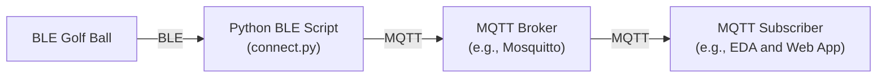

# putting-demo-summit
Demo material for Red Hat Summit demonstration with BLE golf ball

`connect.py` is designed to connect to a BLE-enabled golf ball, write a command to activate data collection, and listen to notifications from various characteristics that provide information about the golf ball's movements and interactions

`scan.py` is a helper app that allows somebody to search for a BLE device by regex match and print out the characteristics of that device

Event-Driven Ansible (EDA) is able to subscribe to messaging layer components like MQTT which allows EDA to pick up all events published to any topics:
```
colin@colin-desktop:~$ mosquitto_sub -h localhost -t '#' -v
golfball/ball1/battery {"battery_level": 100}
golfball/ball2/battery {"battery_level": 100}
golfball/ball1/RollCount {"characteristic": "RollCount", "data": [0, 1]}
golfball/ball1/Velocity {"characteristic": "Velocity", "data": [0, 8]}
golfball/ball1/Ready {"characteristic": "Ready", "data": [0]}
golfball/ball1/BallStopped {"characteristic": "BallStopped", "data": [0]}
golfball/ball1/Velocity {"characteristic": "Velocity", "data": [0, 0]}
golfball/ball1/Ready {"characteristic": "Ready", "data": [1]}
golfball/ball1/RollCount {"characteristic": "RollCount", "data": [0, 0]}
golfball/ball1/BallStopped {"characteristic": "BallStopped", "data": [1]}
golfball/ball2/RollCount {"characteristic": "RollCount", "data": [0, 1]}
golfball/ball2/Velocity {"characteristic": "Velocity", "data": [0, 8]}
golfball/ball2/Ready {"characteristic": "Ready", "data": [0]}
golfball/ball2/BallStopped {"characteristic": "BallStopped", "data": [0]}
golfball/ball2/RollCount {"characteristic": "RollCount", "data": [0, 2]}
```

... or just the ones that will immediately trigger an action:
```
colin@colin-desktop:~$ mosquitto_sub -h localhost -t 'golfball/+/PuttMade' -v
golfball/ball1/PuttMade {"characteristic": "PuttMade", "data": [1]}
golfball/ball2/PuttMade {"characteristic": "PuttMade", "data": [1]}
```

## Diagram



## Requirements

- Python 3.7+
- `bleak` library for Bluetooth Low Energy communication

## Setup

1. Ensure you have Python 3.7 or higher installed.
2. Install the `bleak` library using `pip`:
3. Configure the DEVICE_NAME in the script to match the name of your BLE golf ball.


## Example:

### First player hole in 3 strokes, second player hole in 2 strokes
- `ST_PUTT_NOT_COUNTED` during first player's turn is the result of me carrying the ball to the starting location. Stroke counter is incremented on `ST_PUTT_STARTED`, decremented on `ST_PUTT_NOT_COUNTED` and reset when "new_player" is received on the `golfball/{friendly_name}/command` topic. The `Ready` characteristic == 1 is what starts data collection and is set to 0 when `ST_MAGNET_STOP` is received which signals the ball has landed in the hole. "new_player" message received on the command topic sets `Ready` to 1 to begin data collection for the next golfer.
```
(venv) ➜  putting-demo-summit git:(main) ✗ mosquitto_sub -h localhost -t "#" -v
golfball/golfball1/battery {"battery_level": 100}
golfball/golfball1/ballRollCount {"data": 2, "stroke": 0}
golfball/golfball1/Velocity {"data": 1.7, "stroke": 0}
golfball/golfball1/Ready {"data": 0}
golfball/golfball1/ballState {"data": "ST_PUTT_STARTED", "stroke": 1}
golfball/golfball1/ballRollCount {"data": 7, "stroke": 1}
golfball/golfball1/Velocity {"data": 2.6, "stroke": 1}
golfball/golfball1/ballRollCount {"data": 9, "stroke": 1}
golfball/golfball1/Velocity {"data": 1.7, "stroke": 1}
golfball/golfball1/ballRollCount {"data": 11, "stroke": 1}
golfball/golfball1/ballRollCount {"data": 12, "stroke": 1}
golfball/golfball1/Velocity {"data": 0.8, "stroke": 1}
golfball/golfball1/ballRollCount {"data": 13, "stroke": 1}
golfball/golfball1/Velocity {"data": 0.0, "stroke": 1}
golfball/golfball1/ballState {"data": "ST_PUTT_STOPPING", "stroke": 1}
golfball/golfball1/ballState {"data": "ST_BALL_STOPPED", "stroke": 1}
golfball/golfball1/Ready {"data": 1}
golfball/golfball1/ballState {"data": "ST_READY", "stroke": 1}
golfball/golfball1/ballState {"data": "ST_PUTT_COMPLETE", "stroke": 1}
golfball/golfball1/ballRollCount {"data": 0, "stroke": 1}
golfball/golfball1/ballRollCount {"data": 2, "stroke": 1}
golfball/golfball1/Velocity {"data": 1.7, "stroke": 1}
golfball/golfball1/Ready {"data": 0}
golfball/golfball1/ballState {"data": "ST_PUTT_STARTED", "stroke": 2}
golfball/golfball1/ballRollCount {"data": 4, "stroke": 2}
golfball/golfball1/ballRollCount {"data": 7, "stroke": 2}
golfball/golfball1/Velocity {"data": 0.8, "stroke": 2}
golfball/golfball1/Velocity {"data": 0.0, "stroke": 2}
golfball/golfball1/ballState {"data": "ST_PUTT_STOPPING", "stroke": 2}
golfball/golfball1/ballState {"data": "ST_BALL_STOPPED", "stroke": 2}
golfball/golfball1/Ready {"data": 1}
golfball/golfball1/ballState {"data": "ST_READY", "stroke": 2}
golfball/golfball1/ballState {"data": "ST_PUTT_COMPLETE", "stroke": 2}
golfball/golfball1/ballRollCount {"data": 0, "stroke": 2}
golfball/golfball1/ballRollCount {"data": 1, "stroke": 2}
golfball/golfball1/Velocity {"data": 0.8, "stroke": 2}
golfball/golfball1/Ready {"data": 0}
golfball/golfball1/ballState {"data": "ST_PUTT_STARTED", "stroke": 3}
golfball/golfball1/ballRollCount {"data": 2, "stroke": 3}
golfball/golfball1/ballRollCount {"data": 4, "stroke": 3}
golfball/golfball1/Velocity {"data": 1.7, "stroke": 3}
golfball/golfball1/Velocity {"data": 0.0, "stroke": 3}
golfball/golfball1/ballState {"data": "ST_MAGNET_STOP", "stroke": 3}
golfball/golfball1/ballState {"data": "ST_PUTT_COMPLETE", "stroke": 3}
golfball/golfball1/command new_player
golfball/golfball1/Ready {"data": 1}
golfball/golfball1/ballState {"data": "ST_READY", "stroke": 0}
golfball/golfball1/ballRollCount {"data": 0, "stroke": 0}
golfball/golfball1/ballRollCount {"data": 1, "stroke": 0}
golfball/golfball1/Velocity {"data": 0.8, "stroke": 0}
golfball/golfball1/Ready {"data": 0}
golfball/golfball1/ballState {"data": "ST_PUTT_STARTED", "stroke": 1}
golfball/golfball1/ballRollCount {"data": 4, "stroke": 1}
golfball/golfball1/Velocity {"data": 2.6, "stroke": 1}
golfball/golfball1/ballRollCount {"data": 9, "stroke": 1}
golfball/golfball1/ballRollCount {"data": 12, "stroke": 1}
golfball/golfball1/ballRollCount {"data": 14, "stroke": 1}
golfball/golfball1/Velocity {"data": 1.7, "stroke": 1}
golfball/golfball1/ballRollCount {"data": 15, "stroke": 1}
golfball/golfball1/Velocity {"data": 0.8, "stroke": 1}
golfball/golfball1/ballRollCount {"data": 16, "stroke": 1}
golfball/golfball1/Velocity {"data": 0.0, "stroke": 1}
golfball/golfball1/ballState {"data": "ST_PUTT_STOPPING", "stroke": 1}
golfball/golfball1/ballState {"data": "ST_BALL_STOPPED", "stroke": 1}
golfball/golfball1/Ready {"data": 1}
golfball/golfball1/ballState {"data": "ST_READY", "stroke": 1}
golfball/golfball1/ballState {"data": "ST_PUTT_COMPLETE", "stroke": 1}
golfball/golfball1/ballRollCount {"data": 0, "stroke": 1}
golfball/golfball1/ballRollCount {"data": 1, "stroke": 1}
golfball/golfball1/Velocity {"data": 0.8, "stroke": 1}
golfball/golfball1/Ready {"data": 0}
golfball/golfball1/ballState {"data": "ST_PUTT_STARTED", "stroke": 2}
golfball/golfball1/ballRollCount {"data": 7, "stroke": 2}
golfball/golfball1/Velocity {"data": 3.5, "stroke": 2}
golfball/golfball1/ballRollCount {"data": 9, "stroke": 2}
golfball/golfball1/Velocity {"data": 1.7, "stroke": 2}
golfball/golfball1/ballRollCount {"data": 11, "stroke": 2}
golfball/golfball1/Velocity {"data": 0.0, "stroke": 2}
golfball/golfball1/ballState {"data": "ST_MAGNET_STOP", "stroke": 2}
golfball/golfball1/ballState {"data": "ST_PUTT_COMPLETE", "stroke": 2}