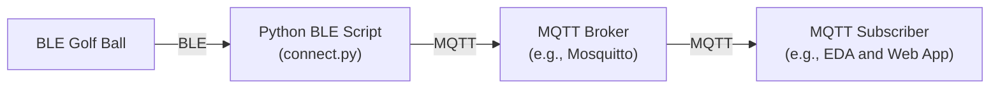

# putting-demo-summit
Demo material for Red Hat Summit demonstration with BLE golf ball

`connect.py` this script is designed to connect to a BLE-enabled golf ball, write a command to activate data collection, and listen to notifications from various characteristics that provide information about the golf ball's movements and interactions.

## Diagram

## Requirements

- Python 3.7+
- `bleak` library for Bluetooth Low Energy communication

## Setup

1. Ensure you have Python 3.7 or higher installed.
2. Install the `bleak` library using `pip`:
3. Configure the DEVICE_NAME in the script to match the name of your BLE golf ball.
