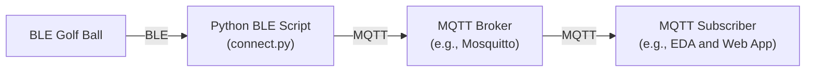

# putting-demo-summit
Demo material for Red Hat Summit demonstration with BLE golf ball

`connect.py` is designed to connect to a BLE-enabled golf ball, write a command to activate data collection, and listen to notifications from various characteristics that provide information about the golf ball's movements and interactions

`scan.py` is a helper app that allows somebody to search for a BLE device by regex match and print out the characteristics of that device

Event-Driven Ansible (EDA) is able to subscribe to messaging layer components like MQTT which allows EDA to pick up all events published to any topics:
```
colin@colin-desktop:~$ mosquitto_sub -h localhost -t '#' -v
golfball/ball1/battery {"battery_level": 100}
golfball/ball2/battery {"battery_level": 100}
golfball/ball1/RollCount {"characteristic": "RollCount", "data": [0, 1]}
golfball/ball1/Velocity {"characteristic": "Velocity", "data": [0, 8]}
golfball/ball1/Ready {"characteristic": "Ready", "data": [0]}
golfball/ball1/BallStopped {"characteristic": "BallStopped", "data": [0]}
golfball/ball1/Velocity {"characteristic": "Velocity", "data": [0, 0]}
golfball/ball1/Ready {"characteristic": "Ready", "data": [1]}
golfball/ball1/RollCount {"characteristic": "RollCount", "data": [0, 0]}
golfball/ball1/BallStopped {"characteristic": "BallStopped", "data": [1]}
golfball/ball2/RollCount {"characteristic": "RollCount", "data": [0, 1]}
golfball/ball2/Velocity {"characteristic": "Velocity", "data": [0, 8]}
golfball/ball2/Ready {"characteristic": "Ready", "data": [0]}
golfball/ball2/BallStopped {"characteristic": "BallStopped", "data": [0]}
golfball/ball2/RollCount {"characteristic": "RollCount", "data": [0, 2]}
```

... or just the ones that will immediately trigger an action:
```
colin@colin-desktop:~$ mosquitto_sub -h localhost -t 'golfball/+/PuttMade' -v
golfball/ball1/PuttMade {"characteristic": "PuttMade", "data": [1]}
golfball/ball2/PuttMade {"characteristic": "PuttMade", "data": [1]}
```

## Diagram



## Requirements

- Python 3.7+
- `bleak` library for Bluetooth Low Energy communication

## Setup

1. Ensure you have Python 3.7 or higher installed.
2. Install the `bleak` library using `pip`:
3. Configure the DEVICE_NAME in the script to match the name of your BLE golf ball.
